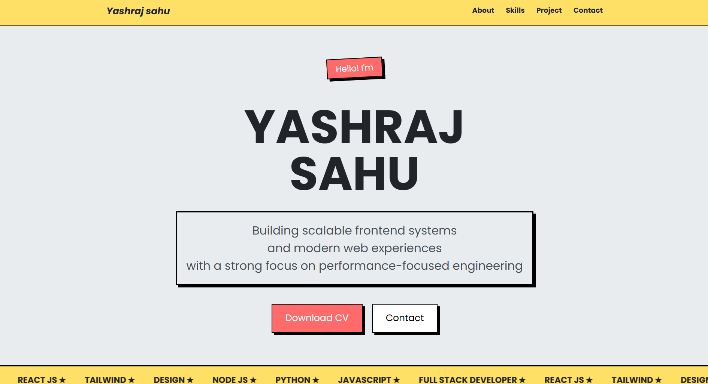

# ᯓ➤ Portfolio

A clean, responsive personal portfolio website built with React and Vite


---

## ⤿  Live Demo

**[View Portfolio →](yashraj-nu.vercel.app)**

---

## ⤿ Preview



---

## ⤿ Features

- **Responsive Design** — Fully optimized for mobile, tablet, and desktop
- **Clean UI/UX** — Minimal layout with a stable yellow + coral color scheme
- **Multi-section Layout** — About, Skills, Projects, and Contact
- **CV Download** — Resume accessible directly from the hero section
- **Pure HTML & CSS** — Zero dependencies, fast load time

---

## ⤿ Project Structure
```
portfolio/
├── public/
├── src/
│   ├── assets/
│   ├── components/
│   ├── App.jsx
│   └── main.jsx
├── .gitignore
├── index.html
├── package.json
├── package-lock.json
├── vite.config.js
└── README.md
```
---

## ⤿ Sections

| Section | Description |
|---|---|
| **About** | Introduction and background |
| **Skills** | Technical skills and tools |
| **Projects** | Personal and academic projects |
| **Contact** | Ways to connect |

---

## ⤿ Contact

**Yashraj Sahu**
- ⬩ Portfolio: [Live Site](https://yashrajsahu44.github.io/portfolio/)
- ⬩ LinkedIn: [yashraj-sahu-588825375](https://www.linkedin.com/in/yashraj-sahu-588825375)
- ⬩ Email: [yashsahu10th@gmail.com](mailto:yashsahu10th@gmail.com)
- ⬩ GitHub: [@yashrajsahu44](https://github.com/yashrajsahu44)

---

